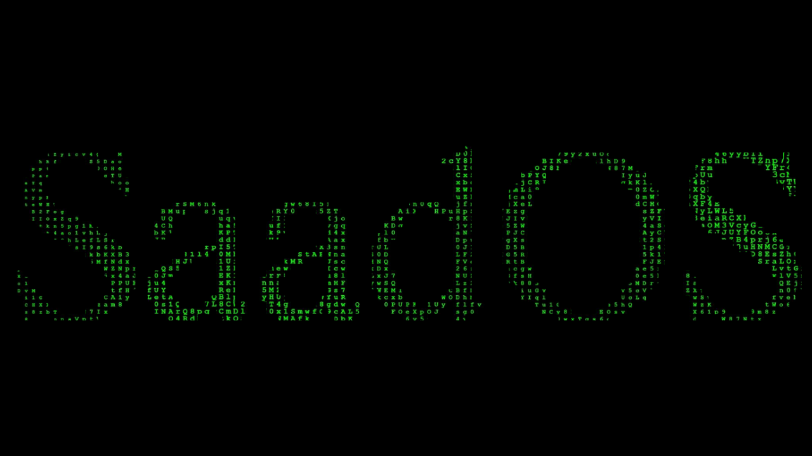

# SaadOS
Simple Operation System written in C++ language , This project is related with [Tasksmoderator](https://github.com/Saad711T/Tasksmoderator) .

## Website
Deployed in [Link](https://saados.netlify.app)
#### Link for copy :
**https://saados.netlify.app**

## Commands
#### Notice : `SaadOS.cpp` is just pre-beta OS
In `SaadOs.cpp` you can do this commands :

- CREATE FILE
- DELETE FILE
- TOOLS
- EXIT

## Save
-After exit from program , save log will be in "saadOSsaving.txt"
